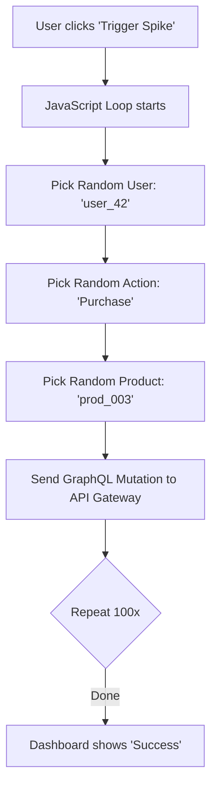
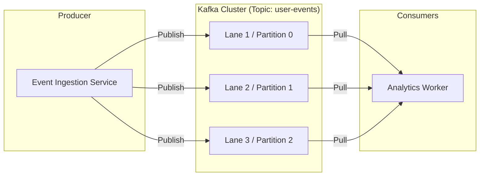
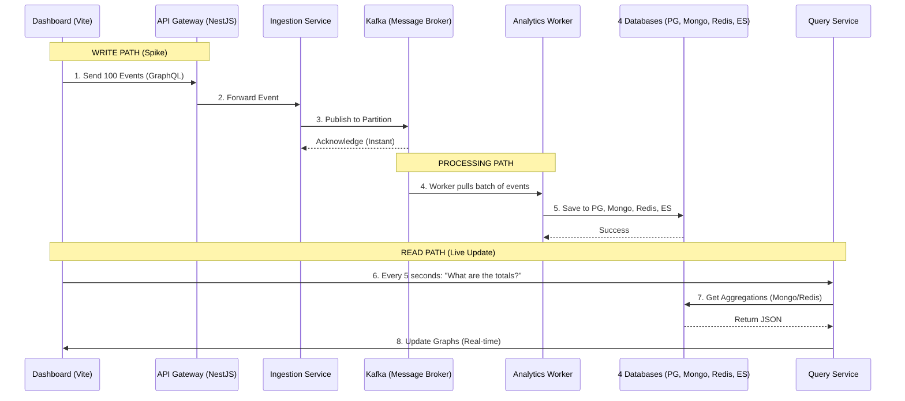

# 🎓 Project Deep Dive: How It Works

This document explains the core architecture of your **Event-Driven Analytics Platform**.

---

## ❓ Q1: How does "Trigger Spike" (100 events) work?
When you click **Trigger Spike** on the dashboard, it doesn't read from a document. It generates **synthetic (random) data** on the fly using JavaScript.

### How it works:
1.  **Frontend Logic**: Inside `dashboard/main.js`, there is a list of random values (User IDs, Product IDs, Event Types).
2.  **Looping**: It runs a loop 100 times.
3.  **Randomization**: For each loop, it picks a random user, a random product, and a random action (Purchase, View, or Click).
4.  **API Call**: It sends each event as a **GraphQL Mutation** to the **API Gateway**.

---

## ❓ Q2: What is Kafka doing? Is it a Database?
**No, Kafka is NOT a database.** 

Think of a Database like a **Warehouse** (where you store items long-term).
Think of Kafka like a **High-Speed Conveyor Belt** (where items move constantly from point A to point B).

### The 3 Core Parts in your Project:

1.  **Producer (Event Ingestion Service)**: This is the worker who puts boxes (events) onto the conveyor belt. It doesn't care who picks them up; it just puts them there and moves to the next one.
2.  **Topic & Partitions (The Highway)**: 
    *   The **Topic** is the name of the road (e.g., `user-events`).
    *   **Partitions** are the **lanes** on that road. Your project has **10 partitions**. This means 10 events can travel side-by-side at the same time! This is why Kafka is so fast.
3.  **Consumer (Analytics Worker)**: This is the worker waiting at the end of the belt. It "consumes" (reads) the events and decides what to do with them.

---

## ❓ Q3: Where do events go after Kafka? Why 4 Databases?
Once the **Analytics Worker** pulls an event from Kafka, it saves it to **4 specialized databases** simultaneously. This is called **Polyglot Persistence** (using the right tool for the right job).

| Database | Role | Why we use it? |
| :--- | :--- | :--- |
| 🐘 **PostgreSQL** | **Source of Truth** | Most reliable. If everything else fails, we reset from here. It stores the *raw* event forever. |
| 🍃 **MongoDB** | **Analytics Summary** | Great for "Aggregations". It stores things like: *"Total revenue today = ₹10,00,000"*. The dashboard reads from here. |
| 🔴 **Redis** | **Speed & Counters** | The fastest. It counts active users and caches your dashboard so it loads instantly (< 10ms). |
| 🔍 **Elasticsearch** | **Search Engine** | **Like a Library Index**. It maps keywords (like `userId`) directly to events so you don't have to "search" through millions of rows. |

---

## 🔍 Deep Dive: How Elasticsearch works?
Elasticsearch is technically a NoSQL database, but it works like the **Index at the back of a textbook**.

1. **Inverted Index**: Normal databases store: `ID -> Content`. Elasticsearch stores: `Word -> List of IDs`.
2. **Speed**: Because it knows exactly which IDs contain "user_1", it finds them in milliseconds, even if you have 100 million events.
3. **Usage**: That's why your **Search Engine** button in the dashboard is so fast — it's not looking at a list; it's looking at a Map!

### Real-time Flow to Dashboard:
1.  **Worker** saves to DBs.
2.  The **Dashboard** polls (asks) the **Query Service** every 5 seconds.
3.  The **Query Service** fetches the newest totals from **MongoDB/Redis**.
4.  The dashboard graph updates instantly.

---

## 🏁 Final Comprehensive Flow Diagram

